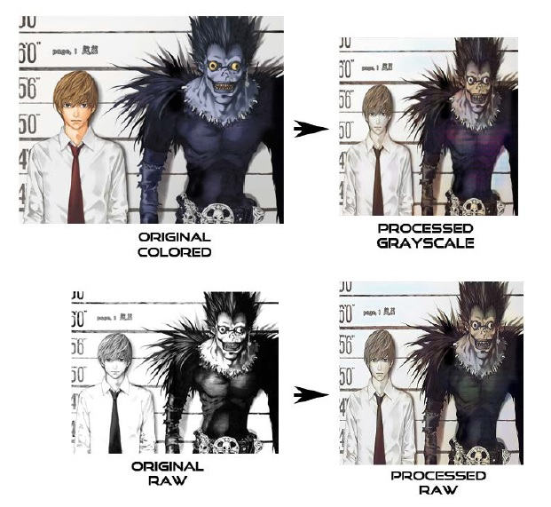
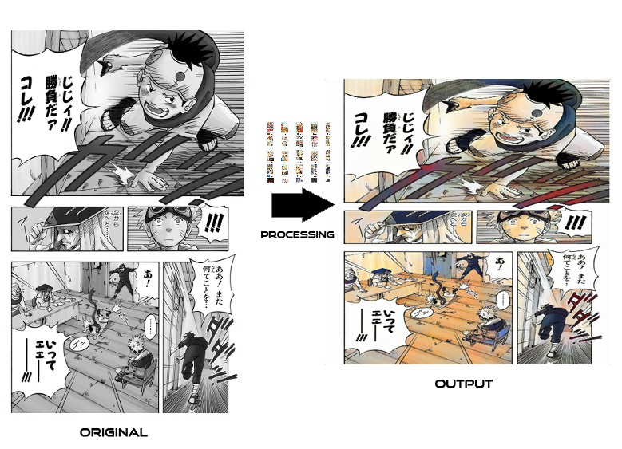

# Comic-Colorization-with-cGAN
A Thesis Presented to the Faculty of California State Polytechnic University, Pomona

**Abstract**
The industry standard for East Asian serialized comic artists and animators is to work extremely long hours and expect very little pay. While this custom seems archaic and unfair towards these hard-working artists, the nature of their line of work is understandably demanding. Serialized comics and animations must be finished quickly to meet weekly deadlines. The quality of these artworks must reach a certain standard to maintain consumer interest. Finally, these artworks must be done cheaply to avoid financial issues. As a result, these comic and animation artists are overworked and underpaid. I propose to ameliorate the nature of the work and to relieve these artists from some of the burden from the nature of their work. Using Conditional Generative Adversarial Networks, I have improved existing methods to automate coloring on black-and-white comic pages, as well as investigated weaknesses in current automated colorization methods available. By automating the coloring portion of an artist’s work, I aim to relieve at least this part of an artist’s busy schedule.

